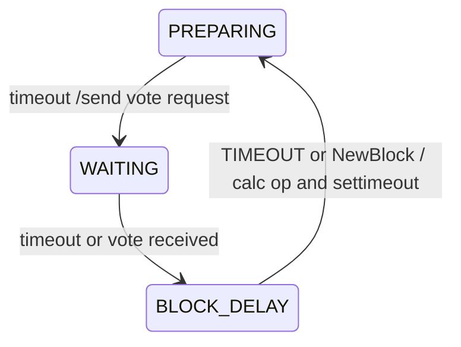

## 区块生成 
### 候选人节点
在新区块到达时，节点计算得到$\pi=sig_{m}(R)$后，计算原始的OP值
$$
 op = \frac {\pi}{2^{256}} \div \frac {P_{m}}{P_{all}}  = \frac {\pi P_{all}}{2^{256}\times P_{m}}

 
$$ 
由于$P_{m}$和$P_{all}$是整数并且大于0，因此op值分布在$(0,P_{all})$之间。我们设定最长的投票延时时间为$D_{max}$秒，可以参与的总节点数为M，则

  计算延时函数
$$
   D= \begin{cases}  0 & op <= 1 \\
   a + f(T,D_{max},P_{all},M, op )  & op >  1 \end{cases}
$$ 
$\pi$越大,延时越大,a和b是用来调整延时因子的参数，调整参数使在一个竞选周期内的可投票的节点在预定的顺位数的2倍左右。如设定竞选周期为T，则产品的每个竞选周期内的参与的节点数的期望值为$2\times P_{max}$, 我们可以选择$a=\frac {T}{2}$,
$$

N = \frac {D_{max}}{T}  \\ 
\\
r= op \times N \\
D=2P_{max} \times r\times (1+b)^{r}
$$

当起始时或是收到新区块后，节点计算OP，开始延时，进入准备投票状态(PREPARING)
1. 如果在延时时间内没有收到新的区块，那么节点根据上一轮的R值，计算得到 代理人，分别向代理人发送投票请求，节点进入等待投票回应状态(WAITING)
2. 节点收到代理人的投票，根据投票的结果计算权重。并且根据权重进入开始延时BLOCK_DELAY
3. 节点如果继续收到代理人的投票，重新计算权重，并且根据权重再次计算延时
4. 节点如果超时，就出块，状态转换到PREPARING
5. 节点如果收到比自身权重更高的区块，就放弃当前的定时器，状态转换到PREPARING

权重延时的计算公式：首先是权重由三个值来表征：
 $$ 
    W = \{Prior,V，Vid\}
 $$

 
 
 其次是延时公式：

$$
T_{d} = \begin{cases}  
1 & V >= \frac{M}{2},Prior=0  \\
2T_{f}\times(\frac{M}{2} -V)+1  & V < \frac{M}{2},Prior=0 \\
3T_{f}+1 - T_{f} \times Prior /(P_{max} -Prior)  & Prior > 0 
\end{cases}
$$

* 此处的$W$是权重，$M$是代理人总数，$Prior$是优先顺位，$V$是该优先顺位的投票者数量,$P_{max}$是总的投票顺位数，而$T_{f}$是平均传输时间
  
### 代理人节点
代理人节点的计时开始时间是以下的几个事件（指有效的）中最早的开始的：
1. 收到出块请求
2. 请求投票，投票请求有可能是候选人直接发来的，也有可能是在委员会节点网络里广播的
3. 上次投票结束
#### 同一轮次内多轮投票
在极端情况下，代理人第一轮投票后，超出一个竞选周期的时间没有收到新的区块，这意味着新的区块的可能都出块失败了。这时候，对第一轮投票结束后的新收到的投票请求再进行一次投票，VID值需要加1，其余的策略与第一次投票一致。