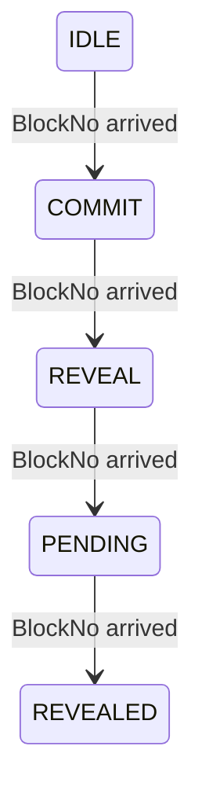
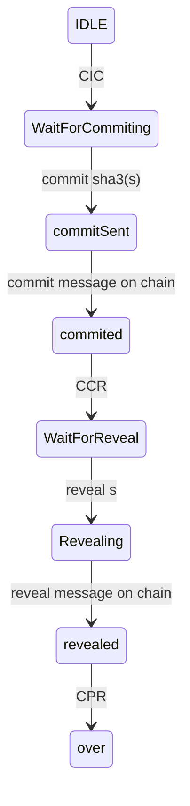

# pnyx实现
在pnyx中，一个角色可以参与多个角色，节点可以通过不同的配置参数，决定是否参与不同的角色运行

## 委员会竞选
委员会竞选有两部分合作构成，一部分是节点参与，另外一部分是出块者执行。节点参与委员会竞选是由节点通过发送消息到消息池中实现的，而出块者在出块时，需要打包这些消息。
### 出块节点过程
出块节点在出块过程中，需要根据选举参与节点的消息更新链上的选举状态信息，选举状态分为5个
链上事件是在链上有显示的信息：
* IDLE：  空闲，没有开始
* COMMIT:  允许大家commit数据
* REVEAL:  允许大家reveal数据
* PENDING: 等待最终reveal之前等待的区块
* REVEALED：委员会结果已经揭晓

*注意* 由于COMMIT和REVEAL都有最小的人数要求，当COMMIT和REVEAL不满足最小人数要求时，使用上一次的加上这一次的

### 节点参与委员会选举
通过发送消息参与委员会竞选，参与委员会竞选的节点分为通过一个状态机进行，节点监控链上的区块信息，当区块状态变化时，节点产生消息，驱动自身的状态机 ，链上的消息如下：
* CIC： chain from IDLE to COMMIT
* CCR:  chain from COMMIT to  REVEAL
* CRP:  chain from REVEAL to PENDING
* CPR:  chain from PENDING to REVEAL

> 委员会竞选节点与要与其他两个模块产生关系，一是messagepool，另外一个是block
> 
> 而出块者除了处理以前的消息之外，需要处理有关参与竞选的消息