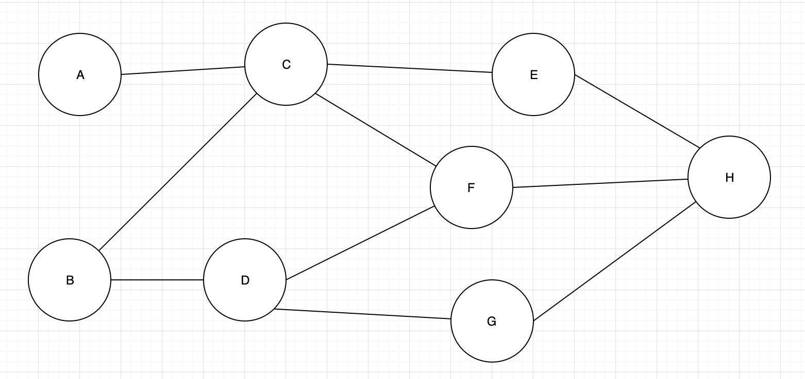

# 概述
与目前所有的区块链广播协议中数据和区块收到后直接转发不同，在pnyx中需要进行延时后再转发，因此不能使用原始的gossip算法。我们在此提出了延时的实现方案，方案由数个算法构成

## 推/拉算法
考虑节点A、B和C，A向B和C发送某个数据块，经过一段时间的延时后，B转发此数据区给C，但此时C已经收到过A发送的数据了，因此这个数据再发送一次是没有意义的。

我们使用如下的方案，当A需要向B发送数据时，A首先向B发送到一个数据传输请求，这个请求里包含了待发送数据块的哈希值，B收到这个请求后，只有当这个数据块不存在时，才会向A请求此数据，因此包含四个步骤：
1.  A 向 B发送 {pushhash,hash}
2.  B 向 A请求 {pullhash,hash}
3.  A 向 B发送 {pushdata,hash,data}
4.  B 验证 Hash(data) == hash

通过这个方式，使数据不会重复传输

## 数据点到点传输

假设有如下的网络拓扑：

当B需要发送数据给H时，从邻节点中寻找$\alpha$个离H更近的节点，向这$\alpha$个中继节点发送数据数据中继请求${,dest,\alpha,ttl,hash}$

因此，我们在发送请求的时候，需要发送如下的对：
${dest,\alpha,ttl,hash}$

